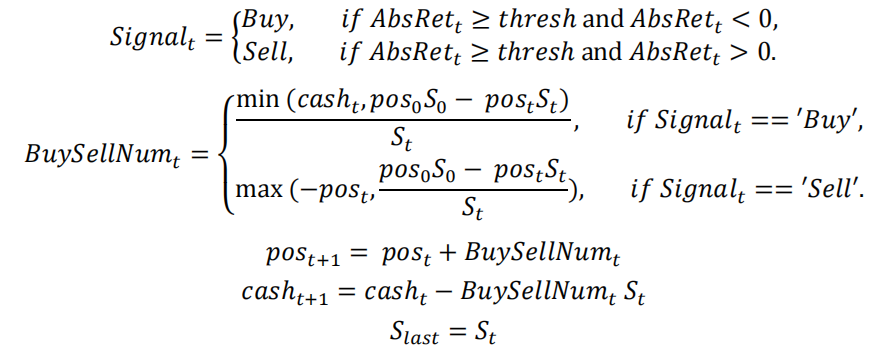

# Snowbow

aka snowball

Submit for 2023 Chainlink Fall Hackathon

# What is Snowball

Snowball structures are non-principal-protected financial instruments with knock-out clauses. In 2003, the first recorded snowball structure product was issued by BNP Paribas in the United States. Over the years, these products gained popularity due to their attractive features, namely high yields. In recent times, snowball products have made significant headway in the Chinese securities market. As of February 2022, the total outstanding amount of snowball products in China surpassed 20 billion US dollars, predominantly linked to stock indexes.

## Snowball in Crypto

While snowball products have been introduced in the crypto space by CEXs like OKX, there is currently no equivalent DeFi offering. As for data from Defillama, the total value locked (TVL) in DeFi derivatives stands at 1.6 billion US dollars, out of a total DeFi TVL of 54 billion US dollars. A significant market opportunity for on-chain snowball products within the DeFi ecosystem.

## Key Features

1. **High-yield Structured Product**: DeFi Snowball offers users a high-yield on-chain structured product, allowing them to earn attractive returns on their investments.

2. **ChainLink Functions Integration**: By leveraging ChainLink Automation and Price Oracle, DeFi Snowball obtains accurate price data from various sources. This enables the platform to effectively monitor and assess the status of the product.

3. **On-chain Automated Hedging**: DeFi Snowball employs on-chain automated hedging to safeguard users' returns and ensure security. This feature provides users with a reliable and secure method to earn profits while minimizing risks.

## Product Brief

Take bullish snowball as an example.

| Params               |                      |
| -------------------- | -------------------- |
| Underlying Assets    | BTC                  |
| Term                 | 28 Days              |
| Knock-out (KO) Price | Initial Price x 103% |
| Knock-in (KI) Price  | Initial Price x 75%  |

Payoff Scenarios:

- KO event: Earnings = Principal x (1 + APR x Term / 365)
- Neither KO nor KI: Earnings = Principal x (1 + APR x Term / 365)
- KI and the price expires between the strike and KO prices: Earnings = Principal
- KI and the price expires at or below the strike price: Earnings in BTC = Principal / Strike price

## Hedging Strategy
User position is N and 𝛿₀ N value of BTC bought initially. 
At time t, BTC position is 〖𝑝𝑜𝑠〗ₜ, BTC price is 𝑆ₜ, transaction threshold is thresh, last Tx BTC price is 𝑆ₗₐₛₜ, and let 〖𝐴𝑏𝑠𝑅𝑒𝑡〗ₜ=|(𝑆ₜ−𝑆ₗₐₛₜ)/𝑆ₗₐₛₜ |
When 〖𝐴𝑏𝑠𝑅𝑒𝑡〗ₜ≥thresh,

# Technical

Repo Directory:

- [`packages/contracts`](packages/contracts): smart contract
- [`packages/subgraph`](packages/subgraph): subgraph for indexed event
- [`packages/client`](packages/client): frontend for user to interact

Technical Stack: 

- Solidity, Foundry: Write, test and deploy ethereum smart contract
- Chainlink Data Stream: Fetch target assets price to confirm the `knock in` or `knock out` of snowball.
- Chainlink Automation: Ensure the price fetch and hedging strategy.
- The Graph: Index on chain event and provide data for frontend
- React, Typescript, ThirdWeb: build the user interface

Test Contracts(on polygon mumbai):

snowbow factory: [0xbD5a8C111E60867D07D73fcDEd680689D401E2D7](https://mumbai.polygonscan.com/address/0xbD5a8C111E60867D07D73fcDEd680689D401E2D7)

snowbow implementation: [0x456af779eA33E628732b4c505a309B850894C7A2](https://mumbai.polygonscan.com/address/0x456af779eA33E628732b4c505a309B850894C7A2)

price observer: [0xbD2F7657535c2896A930F778e8f5468394522312](https://mumbai.polygonscan.com/address/0xbD2F7657535c2896A930F778e8f5468394522312)

MockAggregator: [0xe44a0b926f6cc5a56af17468f66d84da0de413bb](https://mumbai.polygonscan.com/address/0xe44a0b926f6cc5a56af17468f66d84da0de413bb)

MockWBTC: [0x3d56dC8D257Db1085fD4f47F7fCCeCE279FB330b](https://mumbai.polygonscan.com/address/0x3d56dC8D257Db1085fD4f47F7fCCeCE279FB330b)

MockUSDC: [0x42efba52668d124e8c7427aa7cb2c4fe7212109a](https://mumbai.polygonscan.com/address/0x42efba52668d124e8c7427aa7cb2c4fe7212109a)

## Workflow for contract

